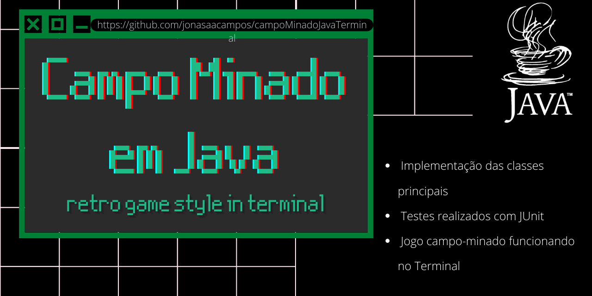

<!-- PROJECT SHIELDS | -->

  

Projeto com o objeto de apriomorar o conhecimento teórico e pratico em Java usando princípios de **Orientação a Objetos** e de **Programação Funcional**

<h1 align="center">Campo Minado em Java</h1>

**Versão:** v1.0

<h2>Como jogar</h2>

Campo minado é um popular jogo de computador para um jogador. Foi inventado por Robert Donner em 1989 e tem como objectivo revelar um campo de minas sem que alguma seja detonada. Este jogo tem sido reescrito para as mais diversas plataformas, sendo a sua versão mais popular a que vinha nativamente nas edições anteriores ao Windows 10.
Fonte: [Wikipedia](https://pt.wikipedia.org/wiki/Campo_minado)

### Regras do Jogo
 - Se você descobrir uma mina, o jogo acaba.
 - Se descobrir um quadrado vazio, você continua jogando.
 - Se parecer um número, ele informará quantas minas estão escondidas nos oito quadrados que o cercam.

### Como Jogar
- Insira as coordenadas de linha e coluna
- Caso deseje sair, ao final do jogo digite _n_ ;
- Caso digite _s_ ou não digite nada, será iniciado um novo jogo

## Progresso
- [x] Implementação das classes principais
- [x] Testes realizados com JUnit
- [x] Jogo campo-minado funcionando no Terminal
- [ ] Refinar interação de entrada de dados
- [ ] Documentar classes

-----------
## Licença de utilização

 
This work is licensed under a <a rel="license" href="http://creativecommons.org/licenses/by/4.0/">Creative Commons Attribution 4.0 International License</a>.

<!-- CONTACT -->
## Contato

  

  

  

**Author:** Jonas Araujo de Avila Campos

**Confira mais projetos: [AQUI](https://jonasaacampos.github.io/portifolio/)**

